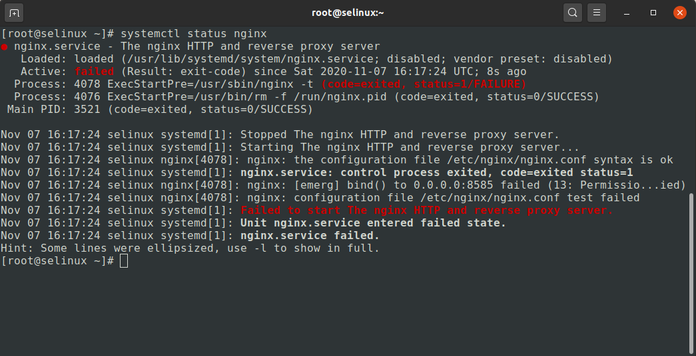
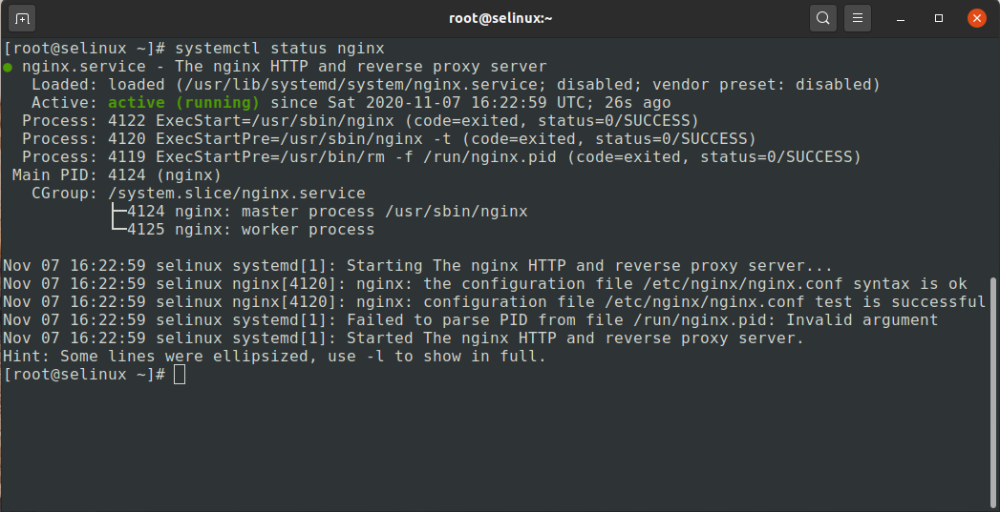
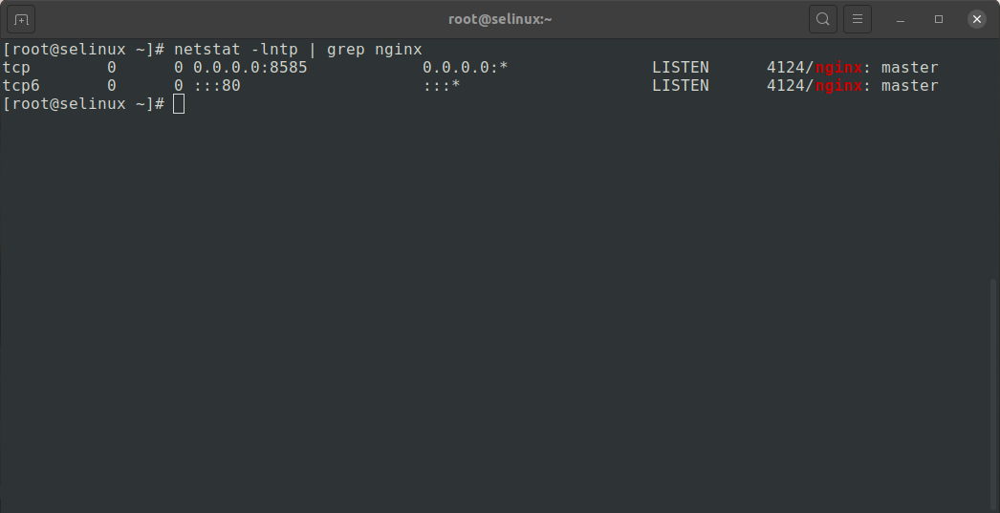
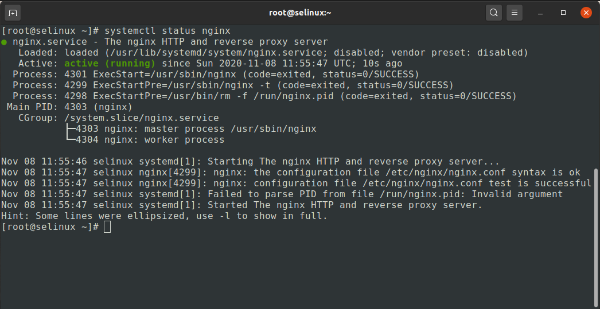
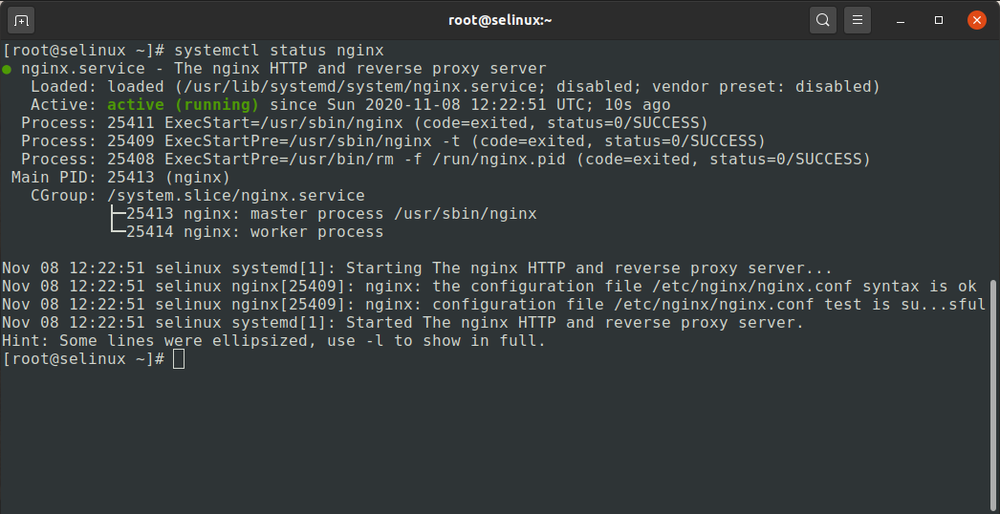

#### Стенд для занития с SELinux.

Цель: 
1. Запустить nginx на нестандартном порту 3-мя разными способами:
- переключатели setsebool;
- добавление нестандартного порта в имеющийся тип;
- формирование и установка модуля SELinux.
К сдаче:

2. Обеспечить работоспособность приложения при включенном selinux.
- Развернуть приложенный стенд
https://github.com/mbfx/otus-linux-adm/tree/master/selinux_dns_problems
- Выяснить причину неработоспособности механизма обновления зоны (см. README);
- Предложить решение (или решения) для данной проблемы;
- Выбрать одно из решений для реализации, предварительно обосновав выбор;
- Реализовать выбранное решение и продемонстрировать его работоспособность.
К сдаче:
- README с анализом причины неработоспособности, возможными способами решения и обоснованием выбора одного из них;
- Исправленный стенд или демонстрация работоспособной системы скриншотами и описанием.

Поднимим виртуальную машину `vagrant up`

**1. Запустим nginx на нестандартных портах 3-мя разными способами**

***1.1. Способ №1.***

Изменим порт nginx на 8585, перезапустип сервис nginx и проверим статус.

```
[root@selinux ~]# systemctl restart nginx
[root@selinux ~]# systemctl status nginx
```



С помощью утилиты `sealert` посмотрим отчет об ошибка из лога `/var/log/audit/audit.log`

```
[root@selinux ~]# sealert -a /var/log/audit/audit.log
```
```
100% done
found 1 alerts in /var/log/audit/audit.log
--------------------------------------------------------------------------------

SELinux is preventing /usr/sbin/nginx from name_bind access on the tcp_socket port 8585.

*****  Plugin bind_ports (92.2 confidence) suggests   ************************

If you want to allow /usr/sbin/nginx to bind to network port 8585
Then you need to modify the port type.
Do
# semanage port -a -t PORT_TYPE -p tcp 8585
    where PORT_TYPE is one of the following: http_cache_port_t, http_port_t, jboss_management_port_t, jboss_messaging_port_t, ntop_port_t, puppet_port_t.

*****  Plugin catchall_boolean (7.83 confidence) suggests   ******************

If you want to allow nis to enabled
Then you must tell SELinux about this by enabling the 'nis_enabled' boolean.

Do
setsebool -P nis_enabled 1

*****  Plugin catchall (1.41 confidence) suggests   **************************

If you believe that nginx should be allowed name_bind access on the port 8585 tcp_socket by default.
Then you should report this as a bug.
You can generate a local policy module to allow this access.
Do
allow this access for now by executing:
# ausearch -c 'nginx' --raw | audit2allow -M my-nginx
# semodule -i my-nginx.pp
```

Посмотрим список разрешенных портов для `http_port_`
```
[root@selinux ~]# semanage port -l | grep -w http_port_t
```
```
http_port_t                    tcp      80, 81, 443, 488, 8008, 8009, 8443, 9000
```
Порт 8585 отсутствует в списке, добавим его
```
[root@selinux ~]# semanage port -a -t http_port_t -p tcp 8585
```
Проверим
```
[root@selinux ~]# semanage port -l | grep -w http_port_t
```
```
http_port_t                    tcp      8585, 80, 81, 443, 488, 8008, 8009, 8443, 9000
```

Перезапустип сервис nginx и проверим статус.
```
[root@selinux ~]# systemctl restart nginx
[root@selinux ~]# systemctl status nginx
```

```
[root@selinux ~]# netstat -lntp | grep nginx
```


Удалим из списка порт 8585, и перезагрузим сервис nginx.
```
[root@selinux ~]# semanage port -d -t http_port_t -p tcp 8585
```
***1.2. Способ №2.***

С помощью параметризованных политик (setsebool и getsebool), внесем изменение для правила `nis_enabled`.

```
[root@selinux ~]# setsebool -P nis_enabled 1
```
```
Перезапустип сервис nginx и проверим статус.
```
```
[root@selinux ~]# systemctl restart nginx
[root@selinux ~]# systemctl status nginx
```


Вернем значение `nis_enabled` в прежнее состояние, и перезагрузим сервис nginx.
```
[root@selinux ~]# setsebool -P nis_enabled 0
```

***1.3. Способ №3.***

Спомощь модуля SELinux, с формируем и установим.

```
[root@selinux ~]# ausearch -c 'nginx' --raw | audit2allow -M my-nginx
[root@selinux ~]# semodule -i my-nginx.pp
```
Убедимся что модуль есть в ядре.
```
[root@selinux ~]# semodule -l | grep my-nginx

my-nginx	1.0
```
```
Перезапустип сервис nginx и проверим статус.
```
```
[root@selinux ~]# systemctl restart nginx
[root@selinux ~]# systemctl status nginx
```


