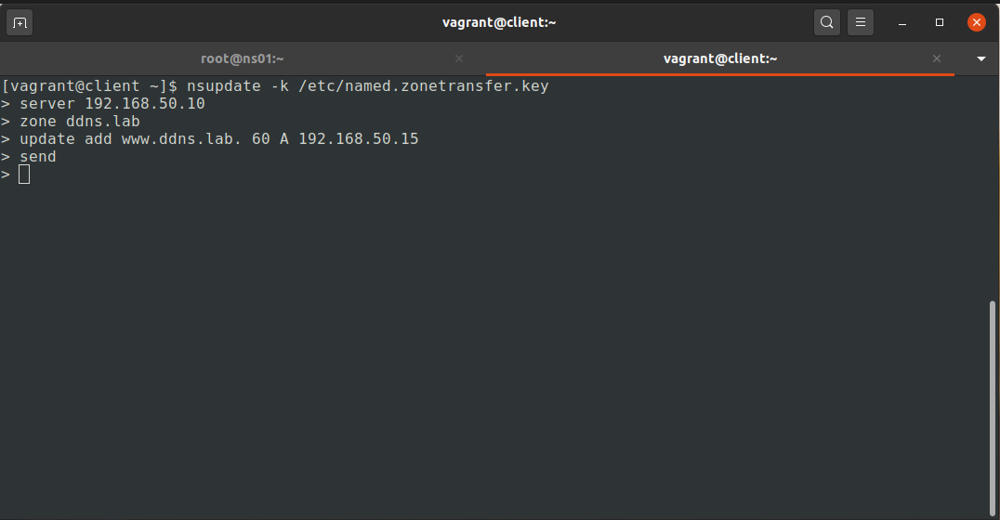

#### SELinux: проблема с удаленным обновлением зоны DNS

Инженер настроил следующую схему:

- ns01 - DNS-сервер (192.168.50.10);
- client - клиентская рабочая станция (192.168.50.15).

При попытке удаленно (с рабочей станции) внести изменения в зону ddns.lab происходит следующее:
```bash
[vagrant@client ~]$ nsupdate -k /etc/named.zonetransfer.key
> server 192.168.50.10
> zone ddns.lab
> update add www.ddns.lab. 60 A 192.168.50.15
> send
update failed: SERVFAIL
>
```
Инженер перепроверил содержимое конфигурационных файлов и, убедившись, что с ними всё в порядке, предположил, что данная ошибка связана с SELinux.

В данной работе предлагается разобраться с возникшей ситуацией.


#### Задание

- Выяснить причину неработоспособности механизма обновления зоны.
- Предложить решение (или решения) для данной проблемы.
- Выбрать одно из решений для реализации, предварительно обосновав выбор.
- Реализовать выбранное решение и продемонстрировать его работоспособность.


#### Формат

- README с анализом причины неработоспособности, возможными способами решения и обоснованием выбора одного из них.
- Исправленный стенд или демонстрация работоспособной системы скриншотами и описанием.

#### Выполнение ДЗ
С помощью утилиты `sealert` посмотрим отчет об ошибка из лога `/var/log/audit/audit.log`

```
[root@ns01 ~]# sealert -a /var/log/audit/audit.log
```
В результате видно что, SELinux запрещает  `/usr/sbin/named` доступ к файлу `named.ddns.lab.view1.jnl`

Предлагает 2 варианта решение этой ошибки.
1й - с помошью утилиты `audit2allow`
2й - с помощью утилиты `semanage`

Первый вариант, с помошью утилиты `audit2allow` не рекомендуеться. При установке модуля, предоставляем преложению большой спектор возможности.

Для решение этой ошибки воспользуемся утилитой `semanage`

С помощью утилиты `audit2why` посмотрим отчет об ошибка из лога `/var/log/audit/audit.log`

```
[root@ns01 dynamic]# audit2why < /var/log/audit/audit.log | grep denied
```
```
type=AVC msg=audit(1604848699.056:1902): avc:  denied  { create } for  pid=4979 comm="isc-worker0000" name="named.ddns.lab.view1.jnl" scontext=system_u:system_r:named_t:s0 tcontext=system_u:object_r:etc_t:s0 tclass=file permissive=0
```
Из отчета видно, что в контексте безопастности отличаеться тип контекста для деректории. Для этого из конфигурации `BING` узнаем, распололжение файла зоны named.ddns.lab.view1

```
[root@ns01 ~]# cat /etc/named.conf | grep named.ddns.lab.view1
        file "/etc/named/dynamic/named.ddns.lab.view1";
```
Посмотрим тип контекста для деректории, где расположен файл зоны `named.ddns.lab.view1`
```
[root@ns01 ~]# ll -Z /etc/named/dynamic/named.ddns.lab.view1
-rw-rw----. named named system_u:object_r:etc_t:s0       /etc/named/dynamic/named.ddns.lab.view1
```

Тип контекста для деректори `/etc/named/dynamic/` отличаеться, для этого изменим тип `etc_t` на `named_cache_t`
```
[root@ns01 ~]# semanage fcontext -a -t named_cache_t '/etc/named/dynamic(/.*)?'
[root@ns01 ~]# restorecon -R -v /etc/named/dynamic/
```

На клиенской станции `client` повторим попытку изменение зоны `ddns.lab`.

```
[vagrant@client ~]$ nsupdate -k /etc/named.zonetransfer.key
> server 192.168.50.10
> zone ddns.lab
> update add www.ddns.lab. 60 A 192.168.50.15
> send
```



